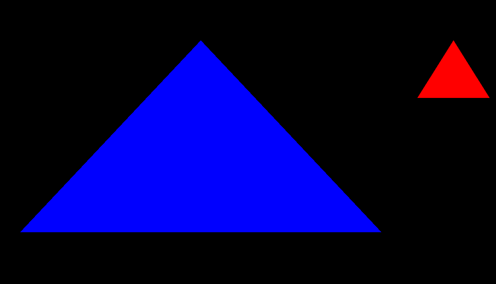
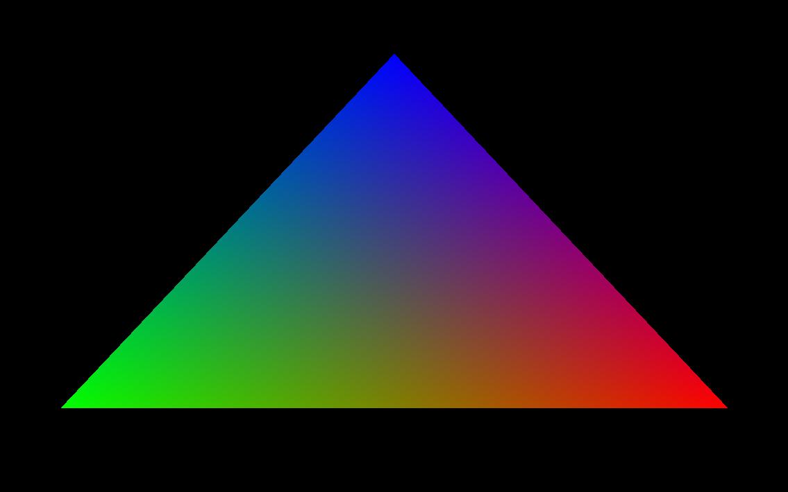
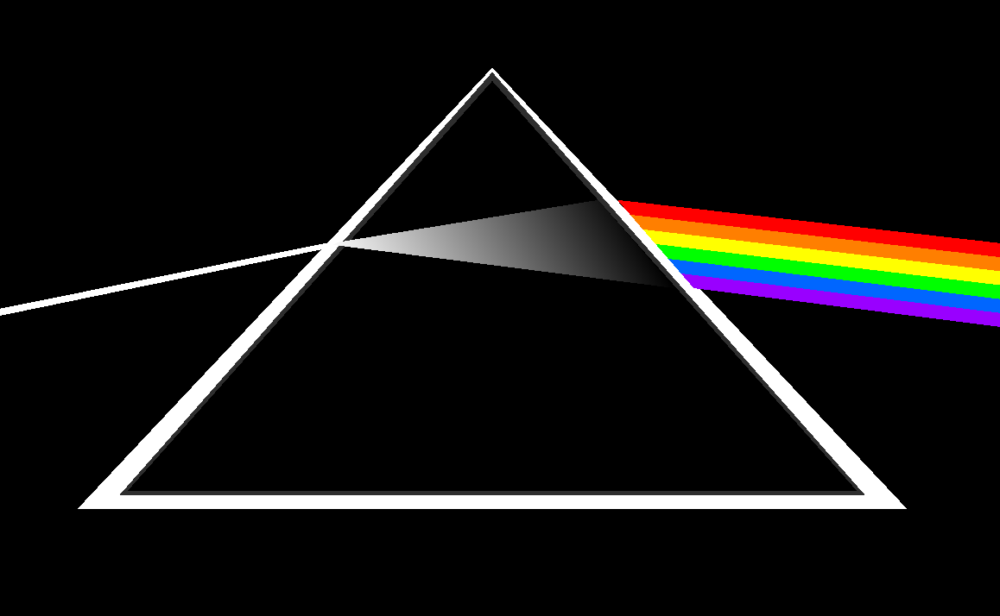
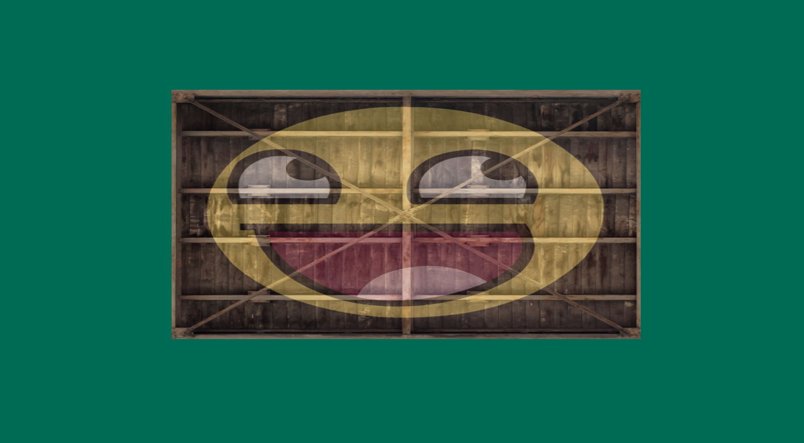

**Basic primitives playground**  
First experiments with OpenGL primitives, VAO/VBO setup, vertex attributes, and color interpolation.

---

**Rasterizer interpolation experiment**  
Testing how the rasterizer interpolates vertex attributes across fragments.  
Used to better understand color blending and the mental model behind interpolated data in the fragment shader.

---

**Pink Floyd logo recreation**  
A small OpenGL study project focused on:
- primitive composition (triangles + indexed rectangles)
- vertex color interpolation
- procedural positioning of light beams
- geometry reuse with VAO/VBO/EBO abstractions

The rainbow beams were generated programmatically by interpolating positions derived from the prism geometry.

---

**Wood wall texture with happy face**  
A small OpenGL texture study project focused on:
- texture loading with `stb_image`
- UV mapping and texture coordinates
- texture wrapping and filtering (`GL_REPEAT`, `GL_MIRRORED_REPEAT`)
- mipmapping for minification
- texture sampling using `sampler2D`